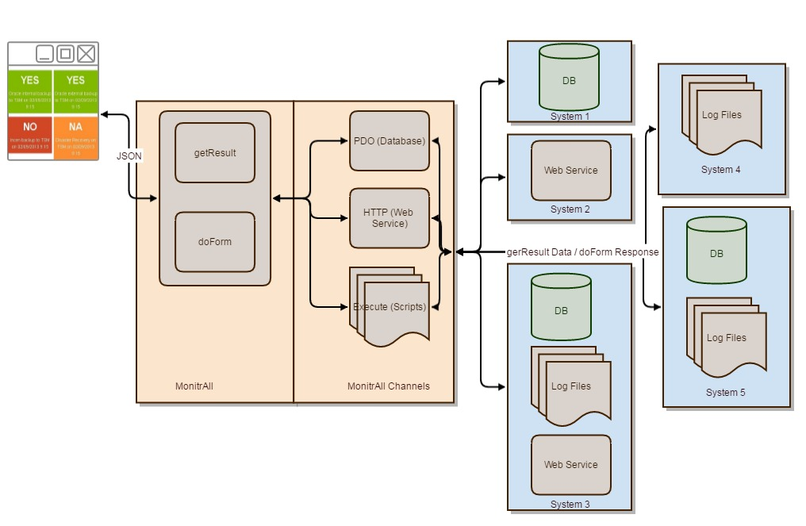
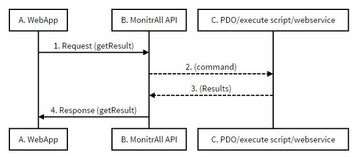

MonitrAll
=========

Monitor everything

MonitraAll is a simple application that basically can read data and present or run commands. The beauty of it lies in the simplicity and agility and its really helpful in monitoring and administering stuff. 

Here's a simplified diagram of how it works:



Features
--------

- It can connect to basically any database that is supported by PDO, execute scripts or call web services as data sources. 
- It can display data in various templates, such as boxes, tables, progress bars, todo, or even graphs. 
- It uses 3 simple rules for each presentation to control its behavior, and those are "what will make you go green, orange, or red"
- It can execute commands either SQL, Web service or Script, based on user input via Forms and Fields.
- It can present numerical data that can afterwards be used for statistical reasons.
- It can display results in dashboards for easier administration of stuff. 
- Every presentation is basically Web Service so it can be reused at any moment.
- It can get statistics by calling the `customStats.php` from the command line.
- It can save check's status for reference or audit reasons by calling the `customChecks.php` from the command line
- It can send emails when by calling `customMotifications.php` from the command line with results, and with preference to condition.

Demo
-----

There is a demo at http://gieglas.byethost10.com/monitralldemo . It's a bit outdated (authenitcation module and dashboards are not included) but you can get the idea. The demo actually uses a snapshot of actual data from a live environment. 

How to use it
-------------

- Check out the `Administration.md` for more details on how to use it. 

How it works
-----------------

The system has a `front application` and a `server side API`. The front side for now is web app with only HTML\css\Javascript. No server side language is involved in the front web app. The API is a PHP application and it uses `slim framework` to easily create REST web services.

Here's a brief explanation for the basic web services. 

###getResult



```sequence
A. WebApp->B. MonitrAll API: 1. Request (getResult)
B. MonitrAll API-->C. PDO/execute script/webservice: 2. (command)
C. PDO/execute script/webservice-->B. MonitrAll API: 3. (Results)
B, MonitrAll API->A. WebApp: 4. Response (getResult)
```

Installation Notes
------------------

1. Files from github
2. Run sqls/createUsers.sql on mysql
3. Run sqls/monitralldb.sql on mysql
4. GRANT ALL PRIVILEGES ON  `monitralldbbare` . * TO  'monitralldbbare'@'localhost' WITH GRANT OPTION ;
5. Run on mysql
    CREATE USER 'phploginonefile'@'localhost' IDENTIFIED BY  'xxxxxxx';
    GRANT USAGE ON * . * TO  'phploginonefile'@'localhost' IDENTIFIED BY  'Passw0rd' WITH MAX_QUERIES_PER_HOUR 0 MAX_CONNECTIONS_PER_HOUR 0 MAX_UPDATES_PER_HOUR 0 MAX_USER_CONNECTIONS 0 ;
6. Run sqls/phploginonefile.sql on mysql
7. Run GRANT ALL PRIVILEGES ON  `phploginonefile` . * TO  'phploginonefile'@'localhost' WITH GRANT OPTION ; on mysql


Noticeable things 
-----------------

It constantly reuses it's self to perform it's core functionality. 
For example the admin forms and views are constructed in monitrAll itself. 
Another way is calling MonitrAll's views from the command line, saving the results in a JSON file. This can be helpful in cases where a check is perfomed at a specific time of the day. The resulted JSON file can also be used to show in monitrAll.

What can it be used for
------------------------

###Monitoring the green light on the server

Create checks to monitor your servers with the simple green, orange, red rules. For example a script that returns the `ping` results. 

###Query values from any database

For example get values from tables in the databases that holds application status. 

###Administrate systems with form s

Make changes using database commans, scripts or webservices to administer stuff.

###Get status of your environment with daily email

Send emails to the right people with the checks (green, orange, red) that concern them at scheduled times. 

###Set KPIS and monitor them

For example create a check to get the sum of sales amounts and set the green, orange, red rules accordingly. You can even use the same check to send emails when for example `red` is reached. 

###Get email notifications on critical checks

Every morning I get an email of all the critical daily checks I need to perform. Saves me a lot of time.

###Statistics

Create results with numeric values and call the customStats.php daily to save these values in the statistics table. 

###Log Checks

Save the green, orange, red status of selected checks using the customChecks.php in the checks table.

###Data quality compliance

Perform queries to get the data quality and present them as a green, orange, red check in terms of data quality compliance. 

###Reconsile synced database results

Perform queries to reconsile data and present them as a green, orange, red check. 

