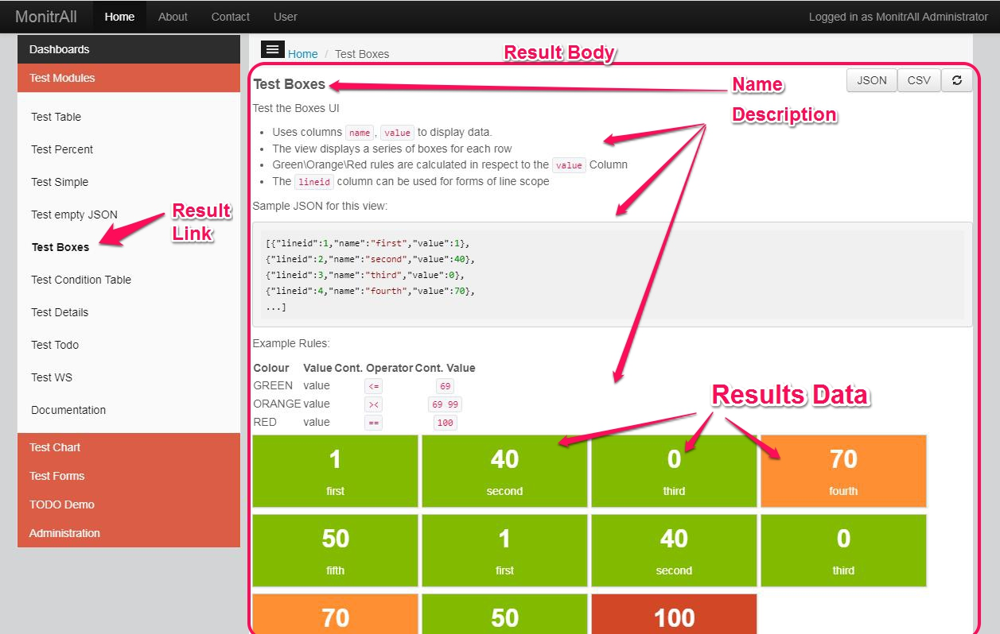
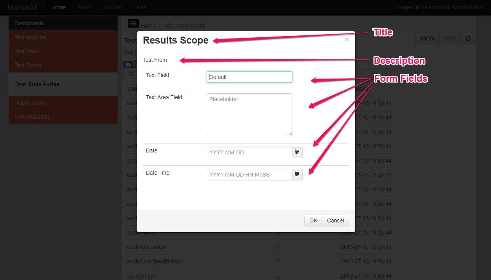

MonitrAll Administration
=============

[TOC]

1. General
----------

This document is intended to be a guide for administrators of the system.

The following fields apply to all the document

- `display order`: defines the order in which the items are displayed on the screen
- `enabled`: whether item is enabled or not

2. MonitrAll Administration Objects
------------------------------------

### 2.1 Groups

Defines the group of results (see below). In the web application the groups are visible on the left menu. 


#### 2.1.1 Group Fields
- `Group Id`: The group id
- `Group Name`: The name of the group as it will appear
- `Group Description`: The group description.
- `Display order`: The order as the groups appear 
- `Enabled`: if it is enabled or not

### 2.2 Results (AKA Modules/Items/Views)

Results are the main feature of MonitrAll and they represent the presentation or results in specific UI formats and/or applicable to Red/Orange/Green conditions. 
Hierarchically they are under `Groups` and they are parents of `forms`. 
Visually links for Results are on the left menu, and the Results themselves are displayed in the center of the Page.
Note that all results created can also be handled as `web services`. To call them as a web service use `POST` method and the following url



```http
api/getResults/resultId
``` 

The response of the webservice is in JSON format. Here is an example

```json
[{"name":"...","value"="..."},...]
```
#### 2.2.1 Results Fields
- `Result Id`: The id of the result. It will be used to call the result as a service. i.e. api\getResults\resultId
- `Result Name`: The result name as it appears on the resultId
- `Result description`: The description of the result. When dispayed it supports markdown syntax.
- `Group`: Link to the group it belongs to 
- `UI type` : The type of the UI. Results will be displayed depending on the template declared. i.e. a chart will display a cart of the results
  
  *UI types:*
  - Table
  - Details
  - Simple
  - Boxes with conditions
  - Table with conditions
  - Percent with conditions
  - Todo with conditions
  - Bar Chart
  - Line Chart
  - Fill Chart
  - Pie Chart

- `Display in front page`: If the result will be displayed on the front.
- `Display module`: If true will be able to be displayed on the browser as a module else will only be available as a service
- `Predefined Connection`: The connection to be used to get the results (as defined in the `config.php`)
- `Condition Operator GREEN/ORANGE/RED`: The operator to be used to compare the data with the defined value for either GREEN ORANGE or RED. 
  
  *Operators:*
  - `>` Number
  - `<` Number
  - `>=` Number
  - `<=` Number
  - `==` Number
  - `!=` Number
  - `><` BETWEEN number to use this put the numbers you want to compare staring from the smallest separated with a space. i.e. `0 100`
  - `===` String 
  - `!==` String

- `Condition value for GREEN/ORANGE/RED`: The value to be compared with the value of the record being displayed on each row, using the operator above for eithe GREEN, ORANGE, RED.
- `Result Query`: The query to be used to get the results. Depending on the type of connection the query structure may differ (see Predefined Connection). There are 3 type of queries that can be defined depending on the type of connection. No that only one command can be executed in the query field (but if needed a script or stored procedure can be created.)

  - *SQL*. I.E. the following will work 
  ```sql
  SELECT name, value FROM table WHERE error=1; 
  ```
   
  - *Webservice* path (query) can be absolute or relative. I.E. the following will work 
  ```http
  ../data/file.json
  ```
  
  - *Execute* path (query) can be absolute or relative and include arguments. I.E. the following will work
  ```dos
  ..\\..\\scripts\\pingtest.bat serverip
  ```

  - Notice the escaped backslash in the path needs an addictional backslash (escape)

- `Data File`: Not used
- `Display order`: The order to be displayed in the group.
- `Notifications Enabled?`: If the notifications are enabled. Specific to the `Notifications` (NOT Custom notifications)
- `Notification Frequency`: The type of intervale. Values available are `MINITLY | HOURLY | DAILY | WEEKLY | MONTHLY | YEARLY`
- `Notification Interval` : The amount of interval. I.e. 3 with MONTHLY would execute every 3 months
- `Start Notification Date Time`: When to start the Notifications
- `Enabled`: Specific to the whole result, if it is enabled or not.

#### 2.2.2. Other
- For all UI's except `Table` and `Simple`, the results must return a column titled **name** and **value** in order for the conditions to work.
- The column **lineid** will be used to trigger form from each result line (line scope). 
- Webservice path (query) can be absolute or relative. I.E. the following will work 
  ```http
  ../data/file.json
  ```
- Execute path (query) can be absolute or relative and include arguments. I.E. the following will work
  ```dos
  ..\\..\\scripts\\pingtest.bat serverip
  ```
- Notice the escaped backslash in the path needs an addictional backslash (escape)
- Note that (at least in windows) when executing bat scripts, PATH is not used, so use **Full Path** in the bacth file even for the basic commands. I.E. 
  ```dos
  net=c\windows\system32\net.exe
  ```
- Display Front: will show this result in the home page  
- Display Module: if false will not appear in menu but can be used otherwise (as a web service)
- Connection: must be defined in config.php

  

### 2.3 Forms
Forms are a complementary feature of MonitrAll and they represent the execution of actions or filtering in a specific result.
The forms can be used to either filter(`Filter type`) results or execute(`Form type`) actions.
The forms can be either appear on the top of a result(`Result scope`) or appear in each line `Line scope`. 
The `Line` scope can use the special column **lineid** as described in forms to get the respected lineid of each line. 


The forms web service that is called is

```http
api/syncServices
``` 

The normal output of the web service is:

```
?????
```

??? Forms where the provider is `execute` or `webservice` JSON returned is  
```json
[{"name":"...","value"="..."},...]
```
Hierarchically they are under `Results` and they are parents of `Fields`. 



#### 2.3.1 From Fields
- `Form Id`: The id of the form
- `Form Name`: The form name as it appears
- `Parent Results Id`: The Result id that the form appears in 
- `Form Icon`: The icon of the form 
- `Form Description`: The Description of the form as it appears. Note that markdown applies here
- `Select Scope`: The scope of the form as explained above which can be `Result | Line`
- `Form Type`: The type of the form as explained above which can be `Form | Filter`
- `Automatically filter using the lineid`: If the form is of type filter and the lineid is passed, it will filter automatically without showing the form
- `Connection`: The connection to be used to get the results (as defined in the `config.php`)
- `Default values web service URL`: Web service that gets the values of the fileds. 
  Note that all fields must be present in the webservice to complete the values by default. 
  Also note that a previously created view can be used. i.e. `api/getResults/AdminGroupsLine` 
- `Query`: The query to execute. Same rules apply as with the `Results`
- `Results View Id to perorm filter`: Can be used to filter results in a different Result that the one calling (can be used for drill down)
- `Data File`: Not used
- `Display order`: The order as the groups appear 
- `Enabled`: if it is enabled or not

### 2.4 Fields
Fileds are the inputs that are used with forms as explained above. 
The Field Id is the name which will be used as parameters when processing the form's query.

#### 2.4.1 Field Fields
- `Field Id`: This name will be used as parameters when processing the form
- `Field title`: The title that will be displayed in the label of the field. 
- `Form id`: The form that the filed is connected to 
- `Field placeholder`: The placeholder that appears in text,textarea 
- `Field Type`: The type of the input which can be `text | textarea | select | typehead | radio | checklist`
- `default value`: Default static value
- `options URL web service`: The webservice where to get the option values for select, typehead, radio and checklist.  i.e. `api/getResults/AdminResultsSelectNoEmpty`
- `field required`: If the field is required for client side validation  
- `Validation Type`: Standard cliend side validation types which can be `email | url | urlstrict | digits | numbers | alphanum | dateISO | datetimeISO | phone`
- `minimum length`: minimum length of the field for client side validation 
- `max length`: max length of the field for client side validation 
- `Display order`: The order as the groups appear 
- `Enabled`: if it is enabled or not

### 2.5 Notifications
Scheduled notification emails based on time intervals. 
See the `Command Line Tools` for more information on how to implement this.

#### 2.5.1 Fields
- `Notifications Enabled?`: If the notifications are enabled. Specific to the `Notifications` (NOT Custom notifications)
- `Notification Frequency`: The type of intervale. Values available are `MINITLY | HOURLY | DAILY | WEEKLY | MONTHLY | YEARLY`
- `Notification Interval` : The amount of interval. I.e. 3 with MONTHLY would execute every 3 months
- `Start Notification Date Time`: When to start the Notifications
- `Next Notification Date Time`: When the next notification will take place (Autogenetated)

### 2.6 Dashboards ###
For making dashboards out of Results. Similar functionality to the Front Page. 
Create Dashboards and add result items to them. The dashboard links will appear on the left sidebar under `Dashboards`.

3. Command line Tools 
------------------
A series of command line php tools that enhance the functionality of MonitrAll.

### 3.1 Notifications

In order to take advatage of the Notifications functionality described above you need to call the `notifications.php`. 
A scheduler could be used to call the notifications for example every 5 minute or so. 
If the program decides that a notification is triggered based on the last_modify_date and the timing rules of the notification, an email notification will be sent.

```dos
C:\php\php.exe -f C:\Code\htdocs\monitrall\api\notifications.php
```

### 3.2 Custom Notification

You can trigger your own notifications at any time given the desired Result Name(s), the condition you want to cayse the result's notifiation and the email address(es) you want. 
Again a scheduler could be used to trigger custom notifications, making this the most fexible way to trigger notifiations.
The results that will be called **MUST** have a `name` and `value` column. 

```dos
C:\php\php.exe -f C:\Code\htdocs\monitrall\api\customMotifications.php resultName1,resultName2,resultName3 red|orange|green|all [email@company.com,other@company.com]
```

### 3.3 Custom Stats

You can instruct MonitrAll to save the values of the result(s) specified at the time of executing this command in the `stats` table.

The results that will be called **MUST** have a `name` and `value` column. 

```dos
C:\php\php.exe -f C:\Code\htdocs\monitrall\api\customStats.php resultName1,resultName2,resultName3
```

### 3.4 Custom Checks

You can instruct MonitrAll to save the status of a result(s) (RED, GREEN, ORANGE, NO VALUE) at the time of executing this command in the `checks` table.

The results that will be called **MUST** have a `name` and `value` column. 

```dos
C:\php\php.exe -f C:\Code\htdocs\monitrall\api\customChecks.php resultName1,resultName2,resultName3
```

4. MonitrAll config files
------------------------

**config.php**

The file is located under `\api\config\config.php` and the options and connections are defined.

See below a sample of the options:

```php
$monitrall_options = array(
	"useDb" => true,
	"monitrallConnection" => "monitralldb",
	"proxy" => null, //tcp://proxyIp:8080
	"mailserveraddress" => "10.10.10.10",
	"mailserverport" => "25", 
	"webaddress" => "http://localhost:8080/git/monitrall/"
);

/*provider options
Database
--------
mysql
sqlsrv (MS SQL Server)
SYBASE 
oci (Oracle)

Non Database
------------
WEBSERVICE
EXECUTE*/


$db_connections = array (
	"mySQLLocal" => array (
		"id" => "mySQLLocal",
		"server" => "localhost",
		"port" => "",
		"user" => "listes",
		"pass" => "password",
		"name" => "listes", 
		"provider" => "mysql"
	), 
	"WebService" => array (
		"id" => "WebService",
		"server" => "",
		"port" => "",
		"user" => "",
		"pass" => "",
		"name" => "",
		"provider" => "WEBSERVICE"
	),
	"Execute" => array (
		"id" => "Execute",
		"server" => "",
		"port" => "",
		"user" => "",
		"pass" => "",
		"name" => "", 
		"provider" => "EXECUTE"
	),
	"monitralldb" => array (
		"id" => "monitralldb",
		"server" => "localhost",
		"port" => "",
		"user" => "monitralldbbare",
		"pass" => "password",
		"name" => "monitralldbbare",
		"provider" => "mysql"
	)
);

$monitrall_notifications_options = array (
	"email" => array (
		"subject" => "Monitrall Notifications #dd#-#mm#-#yyyy#",
		"bodytop" => "The following results have been triggered for notification.<br>",
		"bodybottom" => "For more details visit Monitrall.",
		"to" => array("admin@test.com"),
		"from" => "admin@test.com"
	)
);

```
**monitrallQueries.php**

The file is located under `\api\config\config.php` and contains the sqls used by the MonitrAll application. Do not change unless you know what you are doing.

5. Authomn Module (User Administration/Security Module)
---------------------------------

This module is responsible for maintaining the users and groups of the software, as well as their Rights.

To access the module click on the Username on the top right, or the User Link on the top menu of the application.


Every user can use the following links to do the basic tasks:

- `Log out`
- `Change Password` (Note: this only applies to non LDAP users)
- `Change Details` (such as display name, email and telephone)

The rest of the functionality is only reserved for the administrators

### 5.1 Authmon Groups

In this section you can create, update, delete a group and define the group's rights. 

#### 5.1.1 Authmon Group Fields
- `Id`: The id of the group.
- `Name`: The group name 
- `description`: The description of the group.
- `Enabled`:  if it is enabled or not

#### 5.1.2 Authmon Group Rights

In this section you can define the allowed Results that can be accessible by the user. Select the approriate checkboxed and click save to update the rights of a group.


### 5.2 Authmon Users

In this section you can create, update, delete a user and assign a group. Note you can create a user in 2 ways:

- **LDAP User**: Using the `Is Ldap?` and `LDAP Server` fields to define the server and the `User Name` field that must match the LDAP entry. Note that you should define the User Name in the following manner `domain\username`. Also in such a  case during log in the user must enter the username in the same manner. 
- **MonitrAll User**: This user is saved in the MonitrAll database and the rules defined in the `\authmon\api\config.php` file apply to them. 

When a user is created an email is sent to them to reset the default password of the user (in case it is not an LDAP user.) If the user does not reset the password, the user cannot have access to the system. 

The administrator can resend the email by clicking on the email icon next to the user.

The User's Group is defined by the `Group Id` dropdown. 

If the user has `Is Admin == TRUE` then he/she is an administrator of the system (both for Authmon and MonitrAll) and the Group Rights do not apply, but rather has access everywhere.


#### 5.2.1 Authmon User Fields
- `User Name`: The user name used while logging in. (See comments about LDAP Users above). Must be unique.
- `Is Ldap?`: Indicates if the user is LDAP or MonitrAll user. (See comments about LDAP Users above)
- `Ldap Sercer`: The LDAP sercer address. (See comments about LDAP Users above). The format of the field shoud be :`ldap://ldapaddress`. Note that changes in the firwall might need to be applied.
- `Group Id`: The group id the user is assigned to. This will define which rights the user has (unless the user is an Admin)
- `Name`: The name of the user to be displayed.
- `Email`: Email of the user. Must be unique and it is used for reseting the password of a user (see comments above).
- `Phone`: Telephone of the user.
- `Is Admin`: If the user is admin (see comments above)
- `Comments`: Comments for the administrators.
- `Enabled`:  if it is enabled or not

### 5.3 Authmon config.php

The file is located under `\authmon\api\config.php` and the rules of the Authmon module (and sql's) are defined. Do not change the sql commands unless you know what you are doing.

See below a sample of the options:

```php
$JWTOptions = array(
	'key' => 'xxxxxxxxxxxxxxxxxxxxxxxxxxxxxxxxxxxxxxxxxxxxxxxxxxxxxxxxx',    // Key for signing the JWT's, I suggest generate it with base64_encode(openssl_random_pseudo_bytes(64))
	'issuer' => 'MonotrAll_api',
	'audience' => 'MonitrAll_clients',
	'refreshin' => '10', // Adding 10 minutes to refresh
	'expire' => 30, // Adding 30 minutes to expire 900
	'passwordPolicy' => '/^\\S*(?=\\S{6,})(?=\\S*[a-zα-ω])(?=\\S*[A-ZΑ-Ω])(?=\\S*[\\d])\\S*$/m',
	// /^: anchored to beginning of string
    // \\S*: any set of characters
    // (?=\\S{6,}): of at least length 6
    // (?=\\S*[a-zα-ω]): containing at least one lowercase letter
    // (?=\\S*[A-ZΑ-Ω]): and at least one uppercase letter
    // (?=\\S*[\d]): and at least one number
    // $: anchored to the end of the string
	'passwordRegexpMessage' => 'Wrong Password structure. Must be at least 6 characters, containing at least one lowercase letter, at least one uppercase letter, and at least one number. No Spaces.',
	'lockTriesNumber' => 5,   // How many wrong password tries locks  the user
	'lockTriesInterval' => 5, //Interval to stay locked
	"monitralldb" => array (
		"id" => "monitralldb",
		"server" => "localhost",
		"port" => "",
		"user" => "monitralldbbare",
		"pass" => "xxxxxx",
		"name" => "monitralldbbare",
		"provider" => "mysql"
	),
	"email" => array (
	    "server" => "mailtrap.io",
	    "port" => 2525,
	    "username" => "username", //if not used set to null
	    "password" => "password", //if not used set to null
		"subject" => "Monitrall User",
		"bodytop" => "<html>This email was produced automatically from MonitrAll's Security module.<br>",
		"bodybottom" => "For more details visit Monitrall. <br> Username: __USERNAME__</html>",
		"to" => "test@test.com",
		"from" => array('noreply@monitrall.com' => 'MonitraAll Admin')
	),
	"webaddress" => "http://localhost:8080/git/monitrall/authmon",
	"resetPasswordAddress" => "resetPass.php"
); 
```

6. Todo
-----
- ~~Better Login and Security~~
- ~~Call results by name rather by id~~
- ~~Dashboards~~
- ~~Drill down we have actually.~~
- Enhance custom checks to save the detail.
