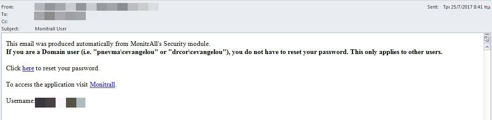
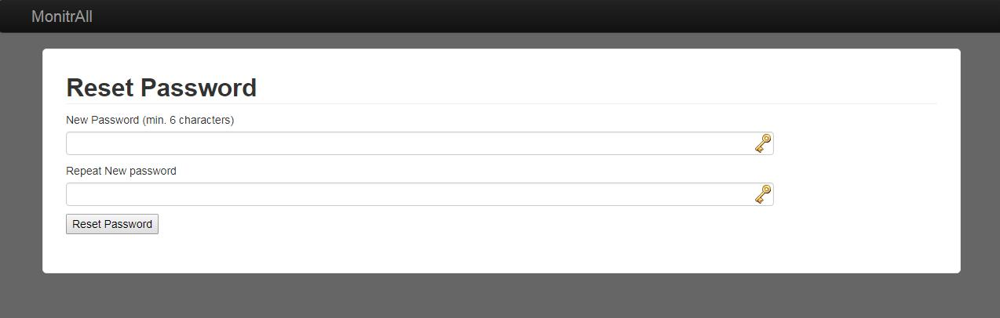
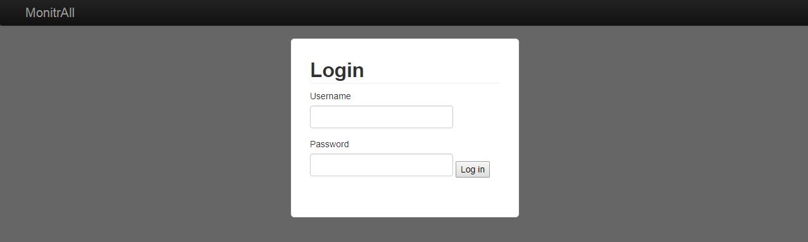
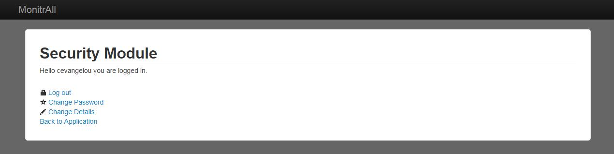
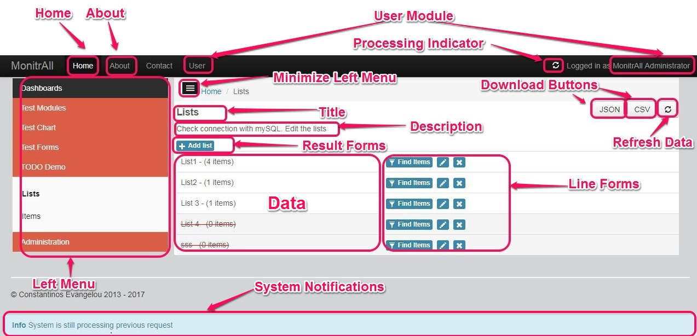
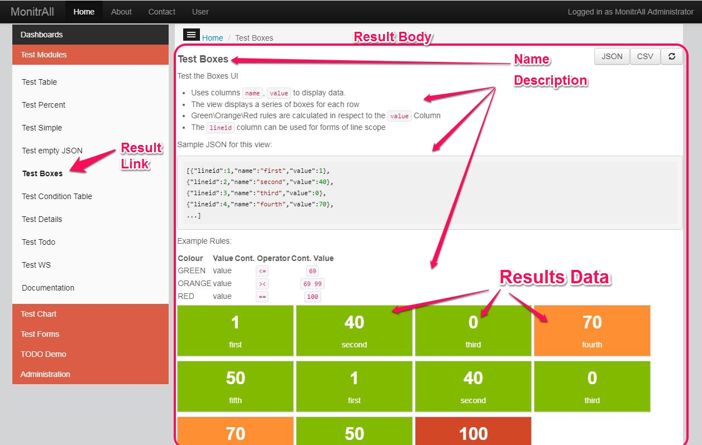
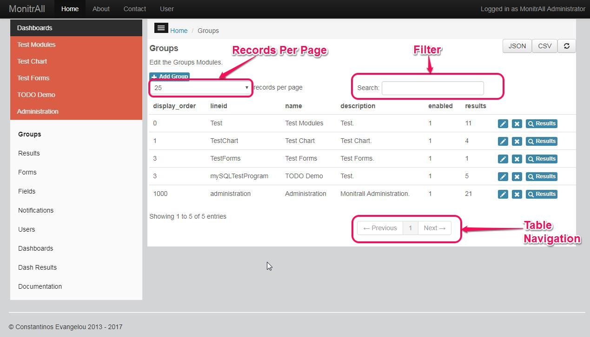
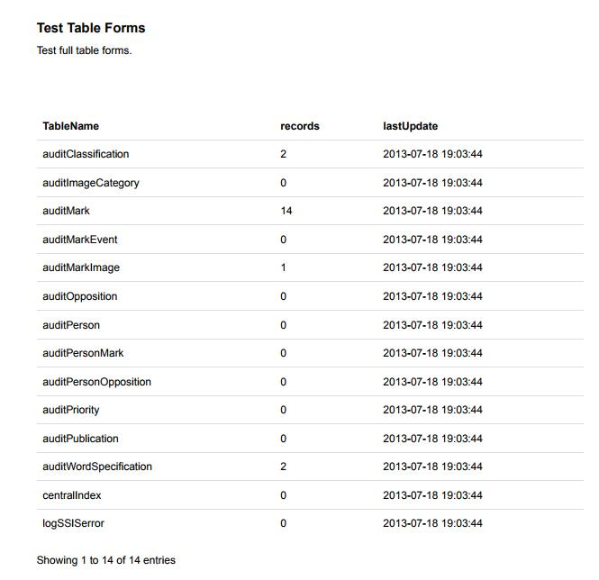
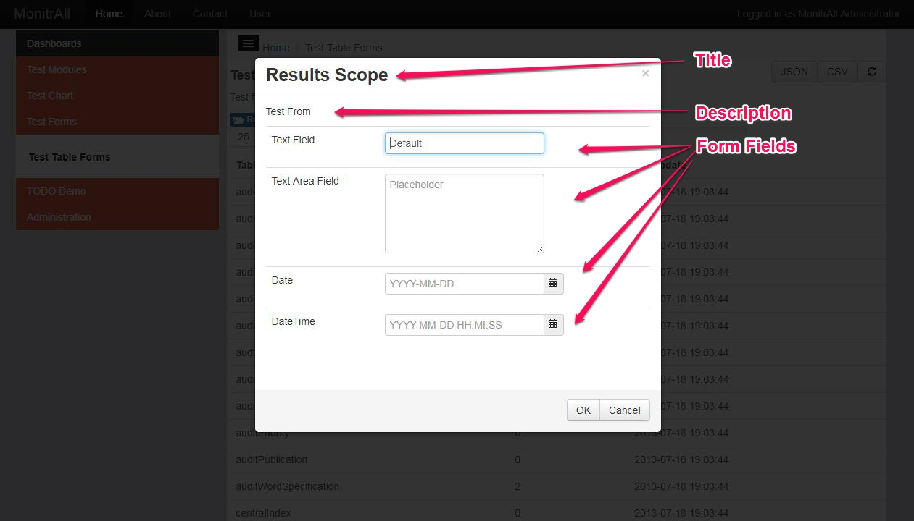
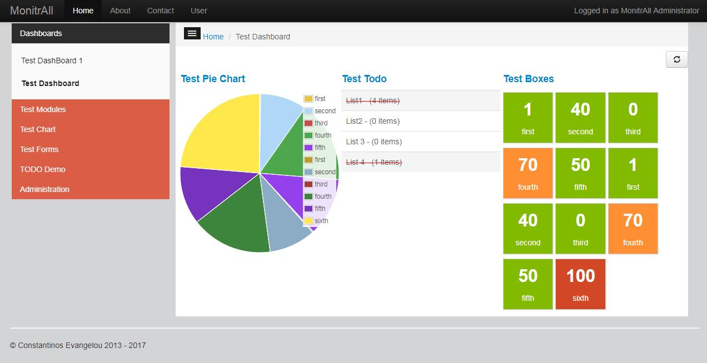

MonitrAll User Manual
==================

[TOC]

This document is intended to be a guide for users of the system.

MonitrAll is a software accessible by modern browsers that can read data and present or run commands.

**Features**

- It can connect to basically any database, execute scripts or call web services as data sources.
- It can display data in various templates, such as boxes, tables, progress bars, todo, or even graphs.
- It uses 3 simple rules for each presentation to control its behavior, and those are "what will make you go green, orange, or red"
- It can execute commands either SQL, Web service or Script, based on user input via Forms and Fields.
- It can present numerical data that can afterwards be used for statistical reasons.
- It can display results in dashboards for easier administration of stuff.
- Every presentation is basically Web Service so it can be reused at any moment.
- It can get statistics.
- It can save check's status for reference or audit reasons
- It can send emails with results, and with preference to condition.

1. Activate User
------------

### 1.1. Activation Email

When a user is created by the administrator an email is sent to the user with information how to activate the user.

Click on the link to reste password in the email to activate the user.

**Note:** If the user is an LDAP or Domain user (i.e. `domain\username`) the user does not need to activate. The reset password page will have no affect on them.

### 1.2. Reset Password

After clicking on the link the user will be redirected to the **Reset Password** page. The user must enter there desired password in the fields `New Password` and `Repeat New password` accordning to the rules defined by the administrators.

**Note:** If the user is an LDAP or Domain user (i.e. `domain\username`) the reset password page will have no affect on them.

2. Login
--------

To access the system the users must first login to the system. If the user is not already logged in the system will automatically display the login page.

In case of an incorrect login (incorrect username or password) the system will allow 5 more tries. After the 5th incorrect try the user will be locked and will automatically be unlocked after 5 minutes.

**Note:** The username must be entered in the same manner as it was displayed on the activation email. 
**Note:** If the user is an LDAP or Domain user (i.e. `domain\username`) the user must enter LDAP or Domain password.

3. Reset Password
-----------------

In case the user desired to reset the password without logging in (i.e. in the case the user has forgotten the password), the user can ask the administrator to send an activation email.

After the administrator sends the activation email the user can follow steps 1. and 2. to reset there password.

**Note:** This does not apply for LDAP or Domain user (i.e. `domain\username`). In such a case the user must contact the LDAP or Domain administrator.

4. User Module
---------------

The user can access the user module by clicking on the **User Module** links (see User Interface Elements below), where the user can `Change Password`, `Change Details` or `Log Out`.

5. MonitrAll User Interface Elements
-------------------------

After logging into the system, each user will be directed to the **Home** page. Form here the user can view in a dashboard like fashion the major **Results** (as indicated by the administrator) and can navigate throughout the system (depending on the user's access rights).

See below an image explaining the main User Interface elements of the system (The image shows a Results page):

++Elements of the page++:
- **Home**: Link to homepage
- **About**: Link to about screen
- **User Module**: Link to User Module (Change Password, Change Details, Logout)
- **Processing Indicator**: Indicates that the system is processing. While processing the system cannot process other requests.
- **Minimize Left Menu**: Minimizes the Left Menu for better use of the user's monitor
- **Download Buttons**: Can download loaded results in `JSON` and `CSV` format
- **Refresh Data**: Refresh the data from the servert
- **Title**: Title
- **Description**: Description and/or instructions
- **Result Forms**: Forms related to the result data. Can execute commands or filter data from the sevrer
- **Line Forms**:  Forms related to the specific line data. Can execute commands or drill down data from the sevrer
- **Left Menu**: Main navigation links grouped by group. Contains all the links that the user has access to. Also links to dashboards
- **System Notifications**: Notification of success, error and info by the system
- **Data**: Data of the Result Page (what we are here for)

###5.1. Results Page

The results page is the main element of the system. Here the user can view the data from the desired data source (as specified by the administrator) in various UI types (such as table, boxes, charts and so on). To navigate to the desired result page use the **Left Menu** or click on a link from a **Dashboard**.

Rules may apply to the result data to indicate **Green**, **Orange** and **Red** conditions (as specified by the administrator).

If available the user can use **Line Form** or **Result Form** buttons to filter the data from the server, or drill down (as specified by the administrator).

If available the user can use **Line Form** or **Result Form** buttons to perform actions related to those data (as specified by the administrator).

Once the data are downloaded to the browser's screen, the user can use the **Download Buttons** to download the data in `JSON` or `CSV` format.

The users will only have access to Result Pages that they have access to.

####5.1.1. Table Results

In case the Result page display's the data in table form, the user has extra functionality on the data downloaded to the user's screen.

As shown on the image above, the user can specify the **Records Per Page**, **Filter** the data already downloaded from the server (from any of the columns of the table) and use the **Table Navigation** buttons, to navigate through the data.

####5.1.2. Printing results

The user can use the default print functionality of the browser to print the results page (for example in chrome `ctrl + p`) in printer friently form.

For better results use the **Minimize Left Menu** button to hide the left menu.

In case of a **Table Results** page, the print functionality will display the data displayed on the screen. If not all data are visible you can use the **Records Per Page** button and select `All` to display all records.

###5.2. Forms

The users can access forms from the **Line Form** or **Result Form** buttons of a result page. These forms can be used to either filter data or execute commands related to the Result page at hand.

After clicking on a **Line Form** or **Result Form** button, the body of the form will be displayed (see image below)

To execute the form with the fields entered, click on the **OK** button.

The users will only have access to Forms that belong to the Result Pages that they have access to.

If specified validation rules might apply to the form fields (as specified by the administrator).

###5.3. Dashboards

Dashboards are **Result Pages** grouped together, without the form buttons. To access the Dashboards you have access to, use the **Left Menu** links under **Dashboards**.

The users will only have access to Dashboards that contain Result Pages that they have access to, and will display only those Result Pages data.

